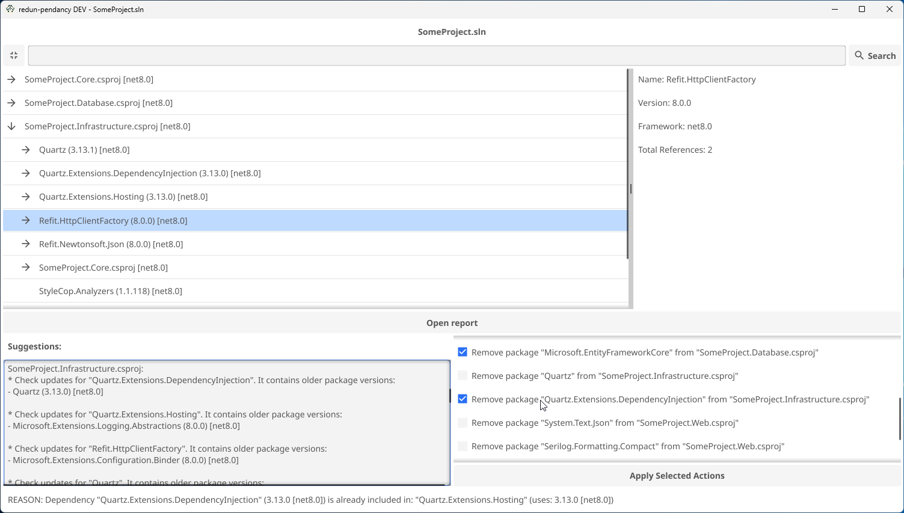
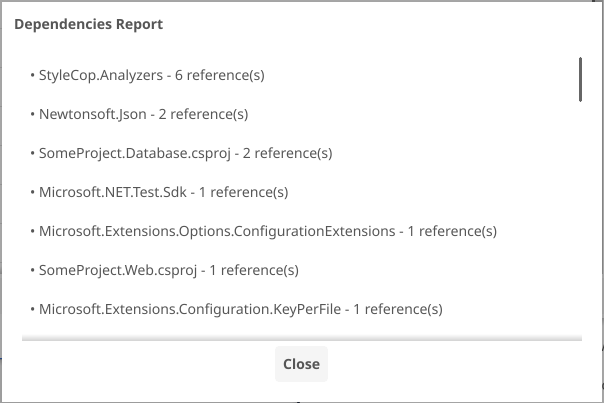

# redun-pendancy

`redun-pendancy` is a tool for analyzing and managing dependencies in software projects.

It identifies issues, offers actionable recommendations, and simplifies project maintenance with an intuitive interface.

## Table of Contents
- [Getting Started](#getting-started)
  - [Downloading the Application](#downloading-the-application)
  - [Running the Application](#running-the-application)
- [Preview](#preview)
    - [Main Window](#main-window)
    - [Report Window](#report-window)
- [Features](#features)
  - [Analyzers](#analyzers)
    - [Core analyzers](#core-analyzers)
    - [Maintenance analyzers](#maintenance-analyzers)
  - [Interface Highlights](#interface-highlights)
- [Supported Files](#supported-files)
- [Planned Features](#planned-features)
- [Developer Reference](#developer-reference)
  - [Architecture](#architecture)
    - [Components](#components)
    - [Project Structure](#project-structure)
  - [Dependencies](#dependencies)
- [Contributing](#contributing)
- [License](#license)

## Getting Started

### Downloading the Application

1. Navigate to the [releases section](https://github.com/N3uR0TiCV0iD/redun-pendancy/releases) of this repository.<br>
You can also find the latest release on the right-hand side of the repository page.

2. Download the latest version of the `redun-pendancy` executable for your platform.

### Running the Application

No installation is required, as the application is portable.

---

⚠️ **NOTE:** Always **backup your project files** (using Git or otherwise) **before** proceeding.

---

1. Drag & drop a [supported file](#supported-files) onto the executable or into the main window (after startup).<br>
   Alternatively, use the command line for a **CLI-only experience**[(*)](#planned-features):
   ```bash
   ./redun-pendancy <project-file>
   ```

2. Click the **Analyze** button to detect issues and improvements.

3. Review the results:
   - Check the "Suggestions section" for improvements.
   - Inspect the "Actions section" for a list of actions to apply.

4. Click on the "**Apply actions**" to execute the selected actions.

5. Review the modified project file(s).

## Preview

#### Main Window


#### Report Window
<br>
*(To be enhanced in the future)*

## Features

### Analyzers
`redun-pendancy` includes a suite of analyzers to handle various aspects of dependency management.

#### Core analyzers

- **Bubble-Up Analyzer**
  - Detects dependencies shared across multiple projects.
  - Suggests moving them up to common ancestors to reduce duplication.

- **Redundancy Analyzer**
  - Detects redundant dependencies that are indirectly included through others.
  - Recommends removal with detailed reasoning and version considerations.

- **Unsorted Dependencies Analyzer**
  - Flags projects with unsorted dependencies.
  - Recommends sorting based on dependency group (projects vs packages).

- **Unused Global Packages Analyzer**
  - Identifies global packages not referenced by any projects.
  - Recommends their removal to simplify and maintain a clean setup.

#### Maintenance analyzers

- **Upgrade Analyzer**
  - Highlights "skipped" (outdated) packages.
  - Suggests dependency upgrades to stay up to date and ensure stability.

### Interface Highlights

- **Dependency Tree**<br>
  Visualize dependencies in a collapsible tree format.

- **Search & Filter**<br>
  Easily find specific packages in the dependency tree.

- **Action Management**<br>
  Apply analyzer suggested actions with just a few clicks.

- **Dependency Information**<br>
  View details about a selected dependency - version, framework & total references.

- **Overview Report**<br>
  Displays dependencies ordered by reference count, from most to least referenced.<br>
  *(Might be enhanced in the future)*

## Supported Files

`redun-pendancy` currently supports the following files:
- `.sln` (.NET solution files)

## Planned Features

The following features are planned for future updates to `redun-pendancy`:

- CLI mode
- Maven support (`pom.xml`)
- NPM support (`package.json`)
- Python support (`requirements.txt`)
- Support for "Legacy .NET project files" (< Visual Studio 2017)

## Developer Reference

### Architecture

`redun-pendancy` follows a modular & extensible architecture based on clearly defined components.

#### Components

- **Package Info**<br>
  Contains package details such as - name, version, framework, dependencies & type.<br>
  This is the <u>**core data structure**</u> used throughout the application.

- **Project Handlers**<br>
  Objects that load "project collections" and provide functionality to manage project dependencies.

- **Project Readers**<br>
  Objects that parse project files into `PackageInfo` instances.

- **Package Loaders**<br>
  Objects that parse package files to identify their dependencies.

- **Package Container**<br>
  Repository that handles registration & lookup of `PackageInfo` instances.

- **Analyzers**<br>
  Objects that examine projects & packages to generate `ProjectActions` and written suggestions.

- **Project Actions** - (*Command pattern*)<br>
  Executable tasks generated by analyzers. They contain the task's description, reasoning and execution logic.<br>
  Actions are applied by **interacting** with a `ProjectHandler`.

#### Project Structure

- `/analysis/` - Contains analysis specific data structures and helpers.
  - `/actions/` - Contains the definition of executable project tasks.
  - `/analyzers/` - Includes the implementation of available project analyzers.
- `/gui/` - Contains custom widgets and utility functions for [Fyne](https://fyne.io/).
- `/handlers/` – Includes project-specific handlers (e.g., .NET, Maven).
- `/models/` – Defines **core/main** data models used across the application.
- `/helpers/` - Contains specialized collections and helpers for handling files, packages, and dependencies.
- `/utils/` – Contains general-purpose utilities, collections, and application helper functions.

### Dependencies
- [etree](https://github.com/beevik/etree) for XML file parsing.
- [Fyne](https://fyne.io/) for cross-platform GUI support.

## Contributing

Contributions to improve the tool or its documentation are welcome. Feel free to:
1. Fork the repository.
2. Make your changes.
3. Submit a pull request.

## License

This project is licensed under the MIT License.

For more details, open the [LICENSE](LICENSE) file in the repository.
